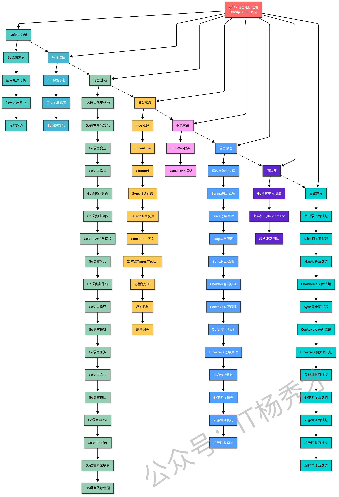

# Go语言进阶之路

GolangGuide是一个专注Go语言学习的知识库，宗旨是：让天下没有难学的Go语言

推荐你通过在线阅读网站进行阅读，体验更好，速度更快！地址：[秀才的进阶之路](https://golangstar.cn)。

>Star/Fork 支持：开源不易，如果这份Go学习教程对你有帮助，希望你能点个Star⭐，你的支持就是我持续更新的动力。  

>转载须知：以下所有文章如非文首说明为转载皆为 GolangGuide 原创，转载请在文首注明出处。如发现恶意抄袭/搬运，会动用法律武器维护自己的权益。让我们一起维护一个良好的技术创作环境！

《Go语言进阶之路》内容结构如下：

### **Go语言前景分析** 👇
- [**Go语言前景**](https://golangstar.cn/go_series/go_prospect/go_prospect.html)：为什么选择Go？Go的应用场景分析

### **环境准备篇** 👇
- [**Go环境搭建**](https://golangstar.cn/go_series/go_environment/go_%20environment.html)：从安装到配置的完整指南

### **语言基础篇** 👇
- [**Go语言代码结构**](https://golangstar.cn/go_series/go_base/go_code_structure.html)：理解Go程序的组织方式
- [**Go语言命名规范**](https://golangstar.cn/go_series/go_base/go_naming_standards.html)：Go语言的命名约定和规范
- [**Go语言变量**](https://golangstar.cn/go_series/go_base/go_variable.html)：数据类型和变量声明
- [**Go语言常量**](https://golangstar.cn/go_series/go_base/go_constant.html)：常量的定义和使用
- [**Go语言运算符**](https://golangstar.cn/go_series/go_base/go_operators.html)：各种运算符的使用和优先级
- [**Go语言结构体**](https://golangstar.cn/go_series/go_base/go_struct.html)：自定义类型和方法定义
- [**Go语言数组与切片**](https://golangstar.cn/go_series/go_base/go_slice.html)：数组和切片的区别与使用
- [**Go语言Map**](https://golangstar.cn/go_series/go_base/go_map.html)：映射类型的操作和应用场景
- [**Go语言条件句**](https://golangstar.cn/go_series/go_base/go_condition.html)：条件控制语句的使用
- [**Go语言循环**](https://golangstar.cn/go_series/go_base/go_loop.html)：循环语句和迭代控制
- [**Go语言指针**](https://golangstar.cn/go_series/go_base/go_pointer.html)：指针的概念和内存地址操作
- [**Go语言函数**](https://golangstar.cn/go_series/go_base/go_function.html)：函数定义、参数传递、返回值
- [**Go语言方法**](https://golangstar.cn/go_series/go_base/go_method.html)：方法接收者和方法集
- [**Go语言接口**](https://golangstar.cn/go_series/go_base/go_interface.html)：接口的定义和多态实现
- [**Go语言error**](https://golangstar.cn/go_series/go_base/go_error.html)：错误处理的Go语言方式
- [**Go语言defer**](https://golangstar.cn/go_series/go_base/go_defer.html)：延迟执行和资源清理
- [**Go语言异常捕获**](https://golangstar.cn/go_series/go_base/go_exception.html)：panic和recover机制
- [**Go语言依赖管理**](https://golangstar.cn/go_series/go_base/go_dependency.html)：使用go module管理项目依赖
- [**Go编码规范**](https://golangstar.cn/go_series/go_coding_standards/go_coding_standards.html)：写出优雅Go代码的最佳实践

### **并发编程篇** 👇
- [**并发概述**](https://golangstar.cn/go_series/go_advanced/concurrency.html)：并发与并行的区别
- [**Goroutine**](https://golangstar.cn/go_series/go_advanced/goroutine.html)：轻量级线程的使用和管理
- [**Channel**](https://golangstar.cn/go_series/go_advanced/channel.html)：通道的各种使用模式
- [**Sync**](https://golangstar.cn/go_series/go_advanced/sync.html)：互斥锁、读写锁、条件变量等同步原语
- [**Select**](https://golangstar.cn/go_series/go_advanced/select.html)：多路复用的通道操作
- [**Context**](https://golangstar.cn/go_series/go_advanced/context.html)：优雅的并发控制和超时处理
- [**定时器**](https://golangstar.cn/go_series/go_advanced/timer.html)：Timer和Ticker的使用场景
- [**协程池**](https://golangstar.cn/go_series/go_advanced/goroutine_pool.html)：Goroutine池的设计和实现
- [**反射**](https://golangstar.cn/go_series/go_advanced/reflect.html)：运行时类型检查和动态调用
- [**范型**](https://golangstar.cn/go_series/go_advanced/generics.html)：Go 1.18+ 泛型编程

### **框架实战篇** 👇
- [**Gin**](https://golangstar.cn/go_series/go_framework/gin.html)：高性能HTTP Web框架实战
- [**GORM**](https://golangstar.cn/go_series/go_framework/gorm.html)：优雅的ORM框架使用指南

### **语言原理篇** 👇
- [**程序初始化**](https://golangstar.cn/go_series/go_principles/initialization.html)：Go程序的启动过程解析
- [**String原理**](https://golangstar.cn/go_series/go_principles/string_principles.html)：字符串的不可变性和内存优化
- [**Slice原理**](https://golangstar.cn/go_series/go_principles/slice_principles.html)：切片的底层数组和扩容策略
- [**Map原理**](https://golangstar.cn/go_series/go_principles/map_principles.html)：哈希表的实现和扩容机制
- [**Sync.Map原理**](https://golangstar.cn/go_series/go_principles/sync.map_principles.html)：并发安全的映射实现
- [**Channel原理**](https://golangstar.cn/go_series/go_principles/channel_principles.html)：通道的底层实现和同步机制
- [**Context原理**](https://golangstar.cn/go_series/go_principles/context_principles.html)：上下文传递和取消机制
- [**Defer原理**](https://golangstar.cn/go_series/go_principles/defer_principles.html)：延迟调用的执行时机和性能
- [**Interface原理**](https://golangstar.cn/go_series/go_principles/interface_principles.html)：接口的底层数据结构
- [**逃逸分析**](https://golangstar.cn/go_series/go_principles/escape_principles.html)：变量分配在栈还是堆的判断
- [**GMP调度原理**](https://golangstar.cn/go_series/go_principles/gmp_principles.html)：Goroutine调度模型深度解析
- [**内存管理**](https://golangstar.cn/go_series/go_principles/memory_principles.html)：Go的内存分配和管理机制
- [**垃圾回收**](https://golangstar.cn/go_series/go_principles/gc_principles.html)：三色标记算法和GC优化

### **测试篇** 👇
- [**Go语言单测**](https://golangstar.cn/go_series/go_testing/go_testing.html)：单元测试、基准测试、表格驱动测试

### **面试题库** 👇
- [**基础面试题**](https://golangstar.cn/go_series/go_interview/base_interview.html)：Go语言基础语法相关面试题
- [**Slice面试题**](https://golangstar.cn/go_series/go_interview/slice_interview.html)：切片相关面试题
- [**Map面试题**](https://golangstar.cn/go_series/go_interview/map_interview.html)：映射相关面试题
- [**Channel面试题**](https://golangstar.cn/go_series/go_interview/channel_interview.html)：通道使用和原理相关面试题
- [**Sync面试题**](https://golangstar.cn/go_series/go_interview/sync_interview.html)：同步原语相关面试题
- [**Context面试题**](https://golangstar.cn/go_series/go_interview/context_interview.html)：上下文相关面试题
- [**Interface面试题**](https://golangstar.cn/go_series/go_interview/interface_interview.html)：接口相关面试题
- [**反射面试题**](https://golangstar.cn/go_series/go_interview/reflect_interview.html)：反射机制相关面试题
- [**GMP面试题**](https://golangstar.cn/go_series/go_interview/gmp_interview.html)：Goroutine调度相关面试题
- [**内存管理面试题**](https://golangstar.cn/go_series/go_interview/memory_interview.html)：内存分配和管理相关面试题
- [**垃圾回收面试题**](https://golangstar.cn/go_series/go_interview/gc_interview.html)：GC机制相关面试题
- [**代码面试题**](https://golangstar.cn/go_series/go_interview/coding_interview.html)：编程实现题和算法题

## 贡献指南

如果你在学习的过程中，**发现有任何错误或者疑惑的地方，可以在相应的 Issues 进行提问或勘误，也可以在[秀才的进阶之路](https://golangstar.cn)网站对应的文章底部留言。**：

## 公众号

如果大家想要实时关注我更新的文章以及分享的干货的话，可以关注我的公众号。

**一个人的学习是孤独的，但是一群人的学习是快乐的。欢迎加入我们的学习交流群，一起学习，一起进步！扫描下方二维码，回复「加群」，拉你进入百人学习交流群。回复「Go面试」，领取Go面试题库PDF。**

---

**如果这个仓库对你有帮助，请给它一个Star⭐！**

